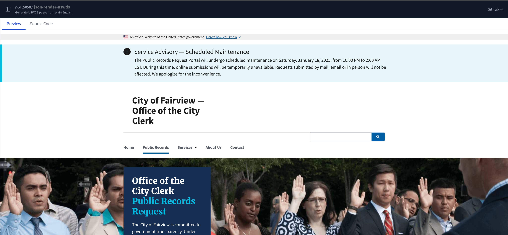

# @cdt5058/json-render-uswds

[](https://github.com/ctrimm/json-render-uswds/actions/workflows/ci.yml)
[](https://www.npmjs.com/package/@cdt5058/json-render-uswds)
[](LICENSE)
[](https://www.typescriptlang.org/)

U.S. Web Design System (USWDS) component library for [`@json-render/core`](https://github.com/vercel-labs/json-render). Generate accessible, government-compliant React UIs from JSON specs.

> Built on top of [json-render](https://github.com/vercel-labs/json-render) by [Vercel](https://vercel.com) — the Generative UI framework for safe, schema-constrained AI-generated interfaces.



## Demo

A live demo app is included in [`examples/demo`](examples/demo). It lets you describe a page in plain English and generate a USWDS spec via AI, or load pre-built fixture pages instantly.

```bash
cd examples/demo
npm install
# Add your Anthropic API key to .env.local
cp .env.example .env.local
npm run dev
```

Then open [http://localhost:3000](http://localhost:3000).

## Install

**Prerequisites:** Node.js `>=22.14.0`, React `^19.0.0`, and `zod ^4.0.0`.

```bash
npm install @cdt5058/json-render-uswds react react-dom @uswds/uswds zod
```

`@json-render/core` and `@json-render/react` are pulled in automatically as runtime dependencies — you do not need to install them yourself. `@uswds/uswds` is an optional peer (only needed if you want to import the CSS from the npm package rather than the CDN).

## Import USWDS CSS

```tsx
import "@uswds/uswds/css/uswds.css";
```

Or via CDN:
```html
<link rel="stylesheet" href="https://cdnjs.cloudflare.com/ajax/libs/uswds/3.8.2/css/uswds.min.css">
```

## Quick Start

### 1. Define your catalog

```typescript
import { defineCatalog } from "@json-render/core";
import { schema } from "@json-render/react/schema";
import { uswdsComponentDefinitions } from "@cdt5058/json-render-uswds/catalog";

const catalog = defineCatalog(schema, {
  components: uswdsComponentDefinitions,
});
```

### 2. Create a registry and render

```tsx
import { defineRegistry, Renderer } from "@json-render/react";
import { uswdsComponents } from "@cdt5058/json-render-uswds";
import type { Spec } from "@json-render/core";

const { registry } = defineRegistry(catalog, {
  components: uswdsComponents,
});

export function MyApp({ spec }: { spec: Spec }) {
  return <Renderer spec={spec} registry={registry} />;
}
```

### 3. Generate a system prompt for AI

```typescript
const systemPrompt = catalog.prompt();
// Pass to your AI model — it will generate specs constrained to USWDS components
```

## v1.0.0 Stable Release

This is the first stable API release of @cdt5058/json-render-uswds. The library is production-ready and recommended for all new projects.

### What's New in v1.0.0

- **Composition-aware architecture** - All collection components (ButtonGroup, CardGroup, Accordion, etc.) now properly accept child AST nodes instead of prop-driven arrays
- **@json-render v0.17.0** - Updated to latest upstream release with improved performance and stability
- **58 USWDS components** - Full coverage of common UI patterns
- **Full TypeScript support** - Complete type definitions for all components
- **Accessibility first** - WCAG 2.1 AA compliant with semantic HTML

### Breaking Changes from v0.2.0

Collection components now use **children-based composition** instead of prop-driven arrays:

#### Before (v0.2.0):
```json
{
  "type": "ButtonGroup",
  "props": {
    "buttons": [
      { "label": "Back", "value": "back", "variant": "outline" },
      { "label": "Next", "value": "next", "variant": "default" }
    ]
  }
}
```

#### After (v1.0.0):
```json
{
  "type": "ButtonGroup",
  "props": { "segmented": false },
  "children": [
    { "type": "Button", "props": { "label": "Back", "variant": "outline" } },
    { "type": "Button", "props": { "label": "Next", "variant": "default" } }
  ]
}
```

### Migration Guide

**Affected Components:**
- `ButtonGroup` - use Button children instead of `buttons` prop
- `CardGroup` - use Card children instead of `cards` prop
- `Breadcrumb` - use Link children instead of `items` prop
- `InPageNavigation` - use Link children instead of `items` prop
- `SideNav` - use Link children instead of `items` prop (supports nesting)
- `Accordion` - use AccordionSection children instead of `items` prop
- **NEW:** `AccordionSection` - child component for Accordion with `title` prop

**Why this change?**
The composition-first model enables the @json-render framework to properly traverse and render deeply nested UI trees. This prevents the "sinkhole bug" where child components in JSON specs were silently discarded during rendering.

### Known Limitations

**Footer component** - Still uses prop-driven `navGroups`, `contactInfo`, and `socialLinks` arrays. Full composition refactoring planned for v1.1.0. The component works well as-is and supports all three variants (slim, big, medium).

## Components

58 USWDS components organized by category:

### Layout
`Grid` `CardGroup` `Card` `Divider` `Footer` `Section`

### Navigation
`Header` `SkipNav` `SideNav` `LanguageSelector` `Link` `InPageNavigation` `Breadcrumb` `Identifier` `GovBanner`

### Data Display
`Collection` `IconList` `Tooltip` `Table` `Heading` `Text` `Prose` `Hero` `GraphicList`

### Feedback
`Alert` `SiteAlert` `Tag` `SummaryBox` `ProcessList`

### Forms
`Button` `ButtonGroup` `Input` `Textarea` `Select` `Checkbox` `CheckboxGroup` `Radio` `FileInput` `Search` `RangeInput` `DateInputGroup` `DateRangePicker` `InputMask` `Password` `ComboBox` `DatePicker` `TimePicker` `CharacterCount` `Modal` `Form`

### Utilities
`Accordion` `Pagination` `StepIndicator` `Icon` `InputGroup` `List` `ValidationChecklist` `EmbedContainer`

## Custom Components

Extend the catalog with your own components alongside USWDS:

```typescript
import { defineCatalog } from "@json-render/core";
import { schema } from "@json-render/react/schema";
import { uswdsComponentDefinitions } from "@cdt5058/json-render-uswds/catalog";
import { uswdsComponents } from "@cdt5058/json-render-uswds";
import { defineRegistry } from "@json-render/react";
import { z } from "zod";

const catalog = defineCatalog(schema, {
  components: {
    ...uswdsComponentDefinitions,
    AgencyBanner: {
      props: z.object({
        name: z.string(),
        logoUrl: z.string().nullable(),
      }),
      description: "Custom agency-specific banner",
    },
  },
});

const { registry } = defineRegistry(catalog, {
  components: {
    ...uswdsComponents,
    AgencyBanner: ({ props }) => (
      <div className="usa-banner">
        {props.logoUrl && }
        <span>{props.name}</span>
      </div>
    ),
  },
});
```

## Accessibility

All components are built to meet federal accessibility requirements:

- **WCAG 2.1 AA** compliant
- Semantic HTML with proper landmark regions
- ARIA roles, labels, and live regions
- Full keyboard navigation
- Visible focus indicators
- Color contrast ratios that meet federal standards
- Accessible form validation and error messages

See the [USWDS Accessibility guidance](https://designsystem.digital.gov/how-to-use-uswds/accessibility/) for more details.

## State Management

Use `StateProvider` from `@json-render/react` to enable data binding:

```tsx
import { StateProvider, createStateStore } from "@json-render/react";

const store = createStateStore({ formData: {} });

<StateProvider store={store}>
  <Renderer spec={spec} registry={registry} />
</StateProvider>
```

## AI-Assisted Development

This repo includes a [Claude Code](https://claude.ai/code) skill at `skills/uswds/SKILL.md`. If you use Claude Code, the skill gives Claude context about all 58 USWDS components, installation, and usage patterns — so it can help you build USWDS specs and catalogs without needing to look things up.

## Troubleshooting

**`Cannot find module '@cdt5058/json-render-uswds'`**
Make sure you've run `npm install` and that your bundler supports the `exports` field in `package.json` (Webpack 5+, Vite, Next.js 12+ all do).

**USWDS styles aren't applying**
You must import the USWDS CSS yourself — it is not bundled. Add one of:
```tsx
import "@uswds/uswds/css/uswds.css"; // via npm package
```
```html
<link rel="stylesheet" href="https://cdnjs.cloudflare.com/ajax/libs/uswds/3.8.2/css/uswds.min.css">
```

**TypeScript errors about `zod` types**
Ensure you have `zod ^4.0.0` installed. Zod 3.x is not compatible.

**Components render but look unstyled**
Check that your bundler is processing CSS imports. In Next.js, import the CSS in `app/layout.tsx` or `pages/_app.tsx`. In Vite, import it in `main.tsx`.

**Demo app fails to start**
The demo requires API keys. Copy `.env.example` to `.env.local` and add at least `ANTHROPIC_API_KEY`. Local model support (Ollama) requires no API key — select a local model from the model picker.

## Credits

This package is a USWDS adapter built on top of **[json-render](https://github.com/vercel-labs/json-render)**, an open-source Generative UI framework created and maintained by [Vercel](https://vercel.com). The core rendering engine, catalog system, schema design, and React renderer are all their work.

- [json-render on GitHub](https://github.com/vercel-labs/json-render)
- [json-render documentation](https://json-render.dev)
- [U.S. Web Design System](https://designsystem.digital.gov/)

## License

Apache-2.0
